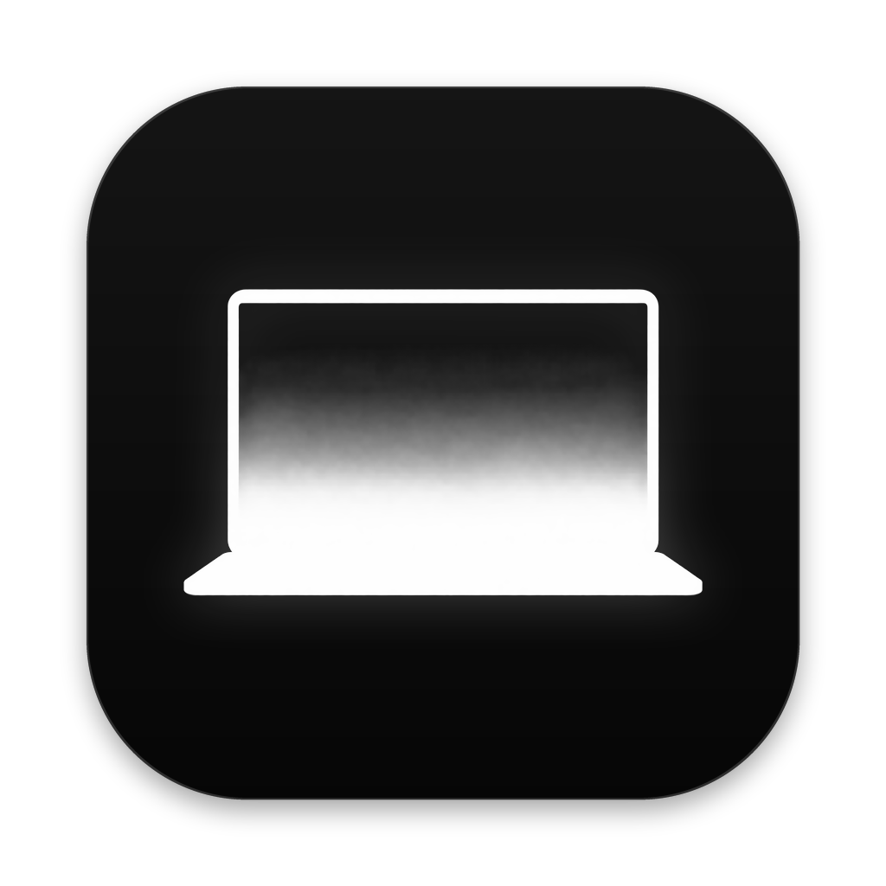

<p align="center">
  
</p>

# NUEM

https://github.com/user-attachments/assets/52e24a28-6ab8-4f4f-a75f-1091c04c7933

A fold animation for your MacBook, inspired by the iPhone Duo. By TGTools123.

When you close the lid, the screen turns into a picture of itself that stays upright while the lid
tilts toward you, then blurs and fades to black just before it shuts. Open the lid and it plays
backwards, ending with a click and a trackpad tap. The hinge angle drives every frame, so it follows
your hand at any speed.

NUEM is a menu bar app written in Swift and Metal, with no dependencies.

## Requirements

- A MacBook with a lid angle sensor: the 16-inch MacBook Pro (2019) and most later MacBooks. The
  M1 MacBook Air and the 13-inch M1/M2 MacBook Pro with Touch Bar don't have one. If the menu says
  "Lid angle sensor not found", yours doesn't either.
- macOS 14 or later.
- To build it yourself only: the Xcode Command Line Tools (`xcode-select --install`).

## Install

### Download

1. Download `NUEM-<version>.zip` from the [latest release](https://github.com/tgtools123/NUEM/releases/latest)
   and open it. (The "Source code" files there are the code itself, to build it yourself.)
2. Drag NUEM into your Applications folder, then open it.
3. The first time, macOS says it can't check NUEM for malware, because NUEM isn't signed with a
   paid Apple developer certificate. Click Done, go to System Settings → Privacy & Security,
   scroll down, click Open Anyway next to "NUEM was blocked", and enter your password. You only do
   this once per version.

In the Terminal, this does the same as step 3: `xattr -dr com.apple.quarantine /Applications/NUEM.app`

### Build it yourself

```sh
git clone https://github.com/tgtools123/NUEM.git
cd NUEM
./build.sh install
```

This builds the app, copies it to Applications and opens it, with no warning from macOS.
`./build.sh` only builds into `./build`, and `./build.sh run` builds and opens it from there.

### First launch

1. The icon appears in the menu bar.
2. macOS asks for Screen Recording permission. NUEM takes one screenshot of the built-in display
   when you start closing the lid. It stays in memory and is thrown away when the animation ends,
   or when the lid opens again if it closed all the way. Nothing is saved or sent anywhere.
3. Turn on NUEM in System Settings → Privacy & Security → Screen & System Audio Recording, and
   relaunch it if macOS asks.
4. Close the lid slowly. The effect starts below 95°.

Preview Effect in the menu plays a 6-second close and open without touching the lid. If the notch
hides the menu bar icon, open NUEM again from Finder or Spotlight to get to Settings.

## Menu

| Item | |
| --- | --- |
| Enable Effect | Turns the effect on or off |
| Preview Effect | Plays a close and open |
| Look | Switch, save, import and share looks |
| Tuning Curves… | Adjust any setting angle by angle |
| Keyframes… | Shape the fold by hand |
| Settings… | ⌘, |
| Support NUEM… | Opens the Ko-fi page |

## Settings

- **General**: a live view of the lid, Screen Recording status, menu bar icon or angle, the angle
  HUD, appearance, lock screen, external displays, open at login, reset.
- **Effect Console**: looks, fold style, perspective, crop and stretch, lift, background color,
  blur, black, keyboard light, pointer fade.
- **Motion**: where the effect starts and ends, Adaptive angle, and smoothing, prediction and
  ahead, the same for closing and opening or set apart.
- **Snap-Back**: click sound, trackpad tap, snap animation, hinge notches.
- **About**: version, support links, source code, credits.

Changes apply right away. The defaults are tuned on a 16-inch MacBook Pro: on another Mac, check
Eye height, Eye distance and the snap corners.

### Fold styles

- **Classic**: the fold alone.
- **Frosted glass**: a glass layer fades in over the picture.
- **Particles**: the picture breaks into glowing particles, and they come back together when you
  open.
- **CRT TV**: an old tube TV that switches off into a line, then a dot.
- **CRT filter**: scanlines and glow over the normal fold.
- **Black & white**: the colors drain out.
- **Hologram**: the picture turns into flickering light and fades away.

Each style has a matching animation for the moment the screen comes back (Settings → Snap-Back).
Its glow follows the screen's rounded corners. macOS doesn't give their radius, so you can set it by
hand, top and bottom, with an outline drawn on the screen to match.
Colors can follow your accent color, your wallpaper, or any color you pick.

### Perspective

By default the fold uses tuned values: compensation, crop and stretch. **Exact perspective**
computes it from the real geometry instead, so the picture stays where the screen was when the
fold began, as seen from your eyes. For that to line up, set Eye height (straight up from the
hinge) and Eye distance (in front of the hinge) to where your eyes really are. Both are shown in
centimetres.

**Lift** moves the classic fold's pivot below the screen, like the real hinge, so the picture rises
as the lid folds. Negative values lower it. Its tuning curve lets it change with the angle.

**Background color** fills the area the picture doesn't cover, and the black vignette takes the
same color so the two blend. The last frames before the lid shuts are always black.

### Motion

The sensor reports the angle about 10 times a second, and each reading is about 100 ms old.
Smoothing hides the steps but adds delay, Prediction guesses where the lid is from its speed, and
Ahead keeps the picture slightly ahead of the lid. Closing and opening can be set apart because a
delay doesn't look the same both ways: while closing, the picture looks a little squashed; while
opening, it looks stretched.

### Adaptive angle

With Adaptive angle on, the fold starts a few degrees below the angle you actually work at. Hold
the lid still for 2 seconds (above 75°) and that becomes your angle. Your tuning isn't changed:
angles are mapped onto it.

## Looks

A look is the whole tuning saved as a `.nuemlook` file. Save one from the Look menu, share the
file, and double-click a look to import it. Looks in `~/Library/Application Support/NUEM/Looks`
show up in the menu. Colors and snap-back settings aren't part of a look.

The file is JSON and only needs the values that differ from the defaults:

```json
{
  "format": "nuem-look",
  "version": 1,
  "name": "Subtle",
  "settings": { "strength": 0.45, "maxBlur": 0.009 },
  "curves": { "blur": [[46.8, 1.3], [90.4, 0]] }
}
```

## Tuning curves

Tuning Curves… shows each setting as a curve against the lid angle. Double-click to add a point,
drag to move it, and press ⌫ to delete it. A curve with points overrides its slider. While the
window is open, the effect stays on screen at whatever angle you hold the lid.

Settings can also be changed from the terminal:

```sh
defaults write io.github.tgtools123.nuem startAngle -float 100
```

| Key | Default | |
| --- | --- | --- |
| `startAngle` | 95 | The effect starts below this angle |
| `minAngle` | 15 | Fully black below this angle |
| `exactPerspective` | false | Exact perspective |
| `eyeHeight`, `eyeDistance` | 1.1, 2.25 | Eye position, in screen heights |
| `lift` | 0 | Lift, in cm (−20 to 20) |
| `backgroundColor` | `#000000` | `#RRGGBB`, `system` or `wallpaper` |
| `foldStyle` | 0 | 0 Classic, 1 Frosted glass, 2 Particles, 3 CRT TV, 4 Black & white, 5 Hologram, 6 CRT filter |
| `smoothing` | 1 | Motion smoothing, 0 to 4 |
| `lookAhead` | 0 | Prediction, 0 to 1 |
| `adaptiveAngle` | false | Adaptive angle |
| `keyboardFade`, `keyboardFadeAngle` | false, 45 | Keyboard light off by this angle |
| `snapVolume` | 0.7 | Click volume, 0 to 1 |

Every key and its default is in `Sources/Settings.swift`.

## Keyframes

Keyframes… opens a window, on your second display if you have one, to shape the fold by hand,
separately from the settings.

1. Turn on Keyframes mode. With no keyframes, nothing moves.
2. Hold the lid at an angle, set the picture's top and bottom edges (height, width and sideways
   shift) with the sliders or by typing the values, and press Keyframe. Keyframes go at whole
   degrees.
3. Between keyframes the shape changes smoothly.

Keyframes are saved in `~/Library/Application Support/NUEM/keyframes.json`, so resetting the
settings doesn't erase them.

## Lock screen and sleep

- The fold also plays over the lock screen (Settings → General). NUEM never shows your desktop
  while the Mac is locked; it uses a picture of the lock screen instead.
- Opening the lid from sleep unfolds from a black screen as soon as the Mac wakes.
- With an external display, turn on "Turn off external displays with the lid" so the built-in
  display stays the main one and opening is quick. The displays come back on when the screen
  snaps back.
- "Stay awake with the lid closed" sets `pmset disablesleep` (it asks for your password) so opening
  doesn't wait for the Mac to wake. It uses battery while the lid is closed and stays on if NUEM
  quits, so turn it off in the same place. Don't carry the Mac in a bag with it on: it stays awake
  and can get hot.

## Privacy

NUEM doesn't collect, keep or send any data. The screenshot it takes when you close the lid stays in
memory and is thrown away after the animation. The lock screen clock is read on the Mac itself.
Settings and keyframes stay on your Mac. NUEM doesn't connect to the internet; the support links
only open your browser.

## Known limitations

- macOS shows the purple recording indicator for a few seconds after each capture.
- The fold shows a still picture of the screen from when the lid started closing.
- Opening from a closed lid starts where the display turns back on, not at 0°.
- The lock screen, trackpad tap, keyboard light and external display features rely on private
  macOS APIs. An update can break them; the rest keeps working.
- Each rebuild can make macOS ask for Screen Recording again.
  `tccutil reset ScreenCapture io.github.tgtools123.nuem` clears the old entry.

## Troubleshooting

- Nothing happens: check the menu. If it says the Screen Recording permission is missing, use
  Allow Screen Recording….
- Logs: `log stream --predicate 'subsystem == "io.github.tgtools123.nuem"' --level debug`

## Support

NUEM is free and open source. If you enjoy it, you can
[leave a tip on Ko-fi](https://ko-fi.com/tgtools123) or
[sponsor it on GitHub](https://github.com/sponsors/tgtools123).

(GitHub may not have approved Sponsors for this account yet. If that page doesn't open, visit the
[profile](https://github.com/tgtools123) in the meantime.)

## Credits

- [chuspeeism/iphone-duo](https://github.com/chuspeeism/iphone-duo) (MIT): the content darkening
  is translated from its shader, and the fixed-eye idea comes from it.
- [samhenrigold/LidAngleSensor](https://github.com/samhenrigold/LidAngleSensor) documented the lid
  angle sensor, [niw/HapticKey](https://github.com/niw/HapticKey) the trackpad actuator, and
  [MatMercer/mactic](https://github.com/MatMercer/mactic) showed that each actuator handle fires
  only once. [Lakr233/SkyLightWindow](https://github.com/Lakr233/SkyLightWindow) showed how to show
  a window above the lock screen. None of their code is included.

## License

NUEM is by TGTools123 (GitHub account 272741180) and licensed under the GNU General Public License v3.0 (see
[LICENSE](LICENSE)), with an attribution term under its section 7(b): copies and modified versions
must keep "By TGTools123" in the About window and the copyright notices in the code (see
[NOTICE](NOTICE)). The darkening code from iphone-duo keeps its MIT notice (see
[THIRD_PARTY_NOTICES.md](THIRD_PARTY_NOTICES.md)). The click sounds are original and covered by the
same license.

iPhone, iPhone Duo, MacBook and MacBook Pro are trademarks of Apple Inc. NUEM isn't affiliated with
or endorsed by Apple.
